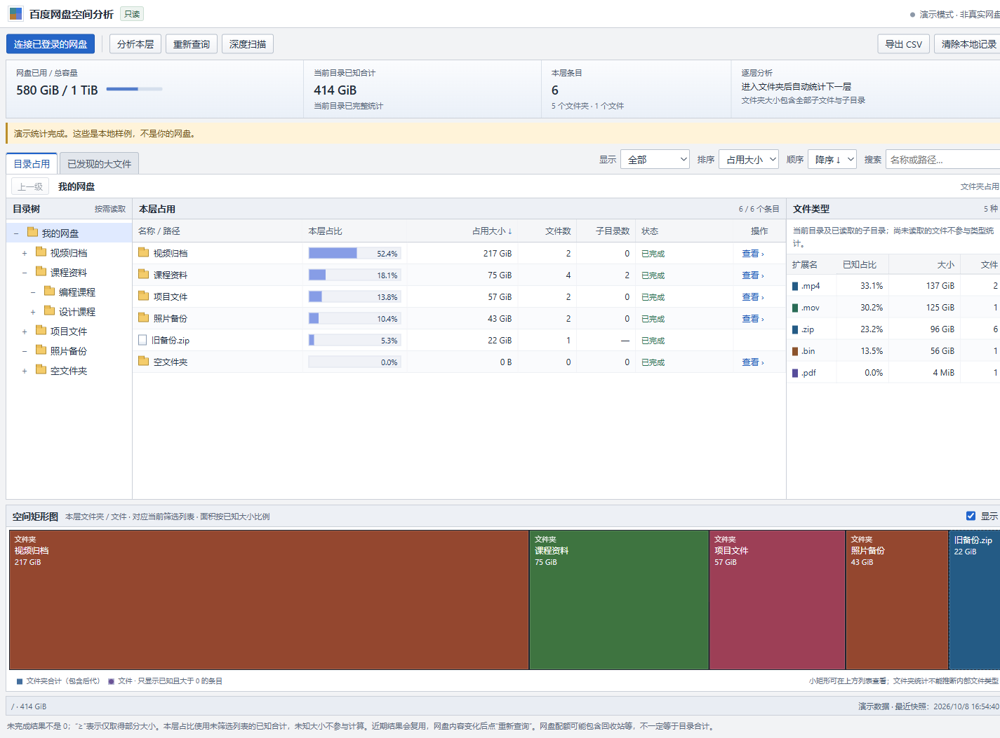

# 百度网盘空间分析

[](https://github.com/YPYT1/baidudisk/actions/workflows/check.yml)

Bun + TypeScript 编写的 Chrome / Edge 浏览器扩展。借用已登录的网盘标签页，取得文件夹含全部子目录的总大小，排序并逐层查看。

使用 Bun + TypeScript 开发的 Chrome / Edge 浏览器扩展。借助已登录的百度网盘网页，查询文件夹包含全部子文件与子目录的总大小，通过排序、目录树和空间矩形图逐层定位占用；需要查看具体大文件时，再对目标目录进行深度扫描。

> **只读、非官方工具。** 不下载、上传、删除、移动或分享云端文件，不要求复制 Cookie、输入密码或配置服务端。使用网页版内部接口，可能遇到登录失效、限流或接口变化。统计成功不代表数据适合直接删除，清理操作请到官方客户端自行确认。

## 界面预览



截图为**演示模式**，名称、容量和文件均是虚构样例，不代表真实网盘数据。文件夹的合计大小与实际读取到的文件类型分别统计，避免将目录合计误认为完整文件清单。

## 可以做什么

- **自动分析每一层**：连接后统计最外层文件夹；点击名称、“查看”、目录树或矩形图，进入后自动统计下一层。
- **按占用定位目录**：显示包含全部后代的文件夹总大小、文件数和子目录数；默认按大小从大到小排列。
- **灵活排序和筛选**：大小、名称、文件数、子目录数支持升降序；可只看文件夹、只看文件或查看全部，并按名称或路径搜索。
- **可视化空间分布**：顶部显示账户容量，底部按已知大小绘制空间矩形图；支持点击文件夹矩形继续下钻。
- **找具体大文件**：深度扫描递归读取目录，“已发现的大文件”集中展示实际读取到的文件；文件类型统计支持点击扩展名筛选。
- **保存和导出结果**：按账户隔离保存本地快照，导出当前筛选列表为 CSV；支持停止、重查和清除本地记录。
- **明确统计边界**：未知、部分完成、失败与完整结果区分显示，未统计不会被当作 0。

## 快速开始

### 1. 构建扩展

先安装 [Bun](https://bun.sh/)，然后在 PowerShell 或其他终端执行：

```powershell
git clone https://github.com/YPYT1/baidudisk.git
cd baidudisk
bun install --frozen-lockfile
bun run build
```

构建后会生成 `dist`，终端会显示该目录的实际绝对路径。源码目录与 `dist` 不是同一个加载位置。

现有本地项目位于 `D:\Project\baidudisk` 时，也可以直接在该目录执行安装和构建命令，然后加载 `D:\Project\baidudisk\dist`。

### 2. 加载到 Chrome / Edge

1. Chrome 打开 `chrome://extensions`，Edge 打开 `edge://extensions`。
2. 开启“开发者模式”，点击“加载已解压的扩展”。
3. 选择刚生成的 **`dist` 文件夹**，其中应有 `manifest.json`。
4. 在**同一个浏览器**打开 [百度网盘网页版](https://pan.baidu.com/disk/main) 并登录。
5. 在网盘标签页点击“网盘空间分析 · 本地只读”的扩展图标，打开独立分析页。
6. 首页自动分析；完成后从最大的文件夹开始逐层查看。

保持来源网盘标签页打开。扩展本身不需要 Bun 预览服务器常驻。目前通过开发者模式加载，尚未发布到浏览器扩展商店。

### 3. 更新已加载的扩展

```powershell
bun run build
```

到扩展管理页点击该扩展的**刷新按钮**，关闭旧分析页，再从网盘标签页重新打开。仅刷新网页不能替代刷新扩展。

### 不登录，先看看界面

```powershell
bun run dev
```

打开 http://127.0.0.1:3210/ ，点击“先看看演示”；或直接访问 http://127.0.0.1:3210/?demo=1 。

这是本地静态预览，**不能连接真实网盘**。演示不会保存到账户记录，也不会发出网盘请求。`dev` 会先构建再启动服务，没有自动热更新。默认只监听本机地址，不对局域网开放。

## 推荐的清理定位方式

1. 连接后，先看最外层的占用排序。例如“视频归档 217 GiB”表示这个文件夹连同全部子文件、子目录的合计，不只是直接放在其中的文件。
2. 进入占用大的文件夹，工具会自动分析下一层；继续下钻，直到找到需要检查的目录。
3. 想定位具体文件时，对**这个目标目录**使用“深度扫描”，通常比递归读取整个网盘更省时间。
4. 在“已发现的大文件”中排序或筛选，必要时导出 CSV。
5. 回到百度网盘官方网页或客户端，核对后自行清理。本工具不会执行删除。

## 两种统计方式有什么区别

### 分析本层：优先使用

只读取当前目录的直接条目，再向官方异步统计接口查询每个直接子文件夹的**完整合计**。无需为了查看文件夹总大小而遍历内部每一个文件。

- 在首页，“本层”就是网盘最外层；进入文件夹后，“本层”就是这个文件夹的下一层。
- 导航会自动执行。“分析本层”按钮用于再次分析或重试。
- 每批提交 10 个文件夹，最多并行 2 批，批次提交至少间隔 150 毫秒。
- 成功目录列表可复用 1 分钟，官方大小可复用 5 分钟；“重新查询”忽略这两种缓存。
- 提交后立即查询任务结果；未完成时逐渐延长等待，任务查询窗口最多两分钟。单个 HTTP 请求最长等待 25 秒，实际结束时间也可能受执行中的请求影响。

这些并发和分组参数是本工具的保守设置，不代表百度公布的限制；官方计算速度、账户状态和网络仍会影响耗时。

### 深度扫描：找具体文件或作为备用

递归分页读取当前目录及全部子目录，把实际文件大小相加。

- 最多并行读取 3 个目录，同一目录的分页串行处理；列表请求启动至少间隔 120 毫秒。
- 每页请求 1000 条；该页大小已在实际账户中确认能返回超过 100 条。
- 会更新具体文件清单、类型统计和大文件视图；不跳过近期目录缓存。
- 官方合计接口不可用时，只要列表接口仍正常，可以用它继续统计。

目录越多，请求越多。因此定位占用时优先逐层分析，需要完整文件清单时再深扫目标目录。

## 如何理解大小与状态

- **文件夹大小包含所有后代**，不是文件夹条目本身的 `size` 字段。
- **未统计 / 待统计**表示未知，不等于 0；只有成功统计出的空目录才显示完整的 `0 B`。
- **`≥` 和部分完成**表示只取得部分大小，停止、失败或缺少分页时不会声称完整。
- **占比**基于未筛选范围的已知合计，过滤名称或条目类型不会改变分母；类型筛选和大文件视图使用对应范围内全部已读取文件作为分母。未知大小不参与计算。
- **矩形图**对应当前筛选列表，仅显示已知且大于 0 的条目；默认最多单独绘制 300 个条目，更小的剩余项合并显示，完整条目仍可在列表中查看。
- **文件类型和大文件列表**只基于实际读取的文件。官方文件夹合计不能推断里面每个文件的名称或扩展名；点击类型后，会显示当前范围及已读取子目录内匹配的文件。
- 使用 `KiB / MiB / GiB / TiB` 等二进制单位，每级为 1024 倍。原始字节数可在大小提示或 CSV 中查看。
- 配额与普通目录合计可能不同，回收站、隐藏空间及其他数据不属于本工具的普通目录统计范围。
- 扫描不是原子快照，其他设备上的修改可能造成短暂不一致。历史快照也可能过期，需要最新数据时点击“重新查询”。

## 权限与隐私

扩展申请 `scripting`、`storage` 和 `https://pan.baidu.com/*` 主机访问：

- `scripting` 用于在已登录的百度网盘标签页内执行固定请求，使用浏览器已有的同源登录状态。
- `storage` 用于扩展自己的 `chrome.storage.local`，保存按账户标识隔离的目录、大小和时间。
- 请求范围固定为账户识别、目录列表、容量、目录统计任务提交与结果查询，不提供任意 URL 或文件修改入口。
- 不读取或导出 Cookie、密码、登录令牌；不向项目作者的服务器上传分析结果，也没有遥测或第三方统计代码。
- 扫描结果**包含私人文件名和路径**。“清除本地记录”只移除当前账户记录；CSV、截图和问题反馈发布前请自行脱敏。

切换账户后会校验身份，阻止将另一个账户的目录写入原账户记录。本地记录太大或保存失败时，页面仍保留结果并提示导出，不会影响云端文件。

## 常见问题

**为什么网页版看不到文件夹大小，这个工具却可以统计？**

目录列表通常返回文件夹 `size=0`，本工具不使用这个字段冒充大小，而是提交官方内部的目录统计计算任务，再查询合计结果。该协议已经实际验证，详情见[接口验证记录](docs/api-verification.md)。它不是百度承诺长期兼容的开放 API。

**找不到网盘标签页 / 连接失败怎么办？**

在加载扩展的同一浏览器打开网页版并登录，保留标签页。多个标签页时，从目标网盘标签页点击扩展图标以指定来源。桌面客户端的登录状态不能直接替代网页登录。

**统计慢、报错或超时怎么办？**

先逐层查询，避免同时打开多个分析页。任务失败或限流时稍后重试；合计接口不可用可对目标目录使用深度扫描。工具不会把错误悄悄显示成 0。

**停止后为什么还需要等待？**

停止会阻止后续查询；已经发出的浏览器只读请求需要退出，官方已提交的计算任务也可能继续运行。保留已完成结果，不代表云端任务被撤销。

**为什么文件类型很少，大文件列表不完整？**

文件夹总大小与具体文件清单是两种数据。进入更多目录或深度扫描后，实际文件才会参与这两个视图。

**更新后还是旧界面怎么办？**

重新构建，刷新扩展，关闭旧分析页并重新打开。启动本地预览服务器或只刷新分析页都不能替代刷新扩展。

**本地预览提示端口 3210 已占用怎么办？**

先访问现有的 http://127.0.0.1:3210/ 。如果是之前启动的本项目服务，构建后刷新页面即可；否则先结束占用端口的服务，再启动预览。

## 开发与验证

已在 Windows、Bun 1.4.2 环境执行完整检查。提交到 GitHub 后，工作流会在 Windows 和 Linux 分别运行依赖安装、HTML 校验、类型检查、单元测试和构建；构建产物会作为工作流附件保留 7 天。

```powershell
bun install --frozen-lockfile
bun run check
```

常用命令：

- `bun run build`：构建浏览器扩展到 `dist`。
- `bun run dev`：构建并启动本地预览服务。
- `bun run lint:html`：检查 HTML 规范与无障碍属性。
- `bun run typecheck`：检查 TypeScript 类型。
- `bun test`：运行接口、分页扫描、取消、调度、缓存和视图计算测试。
- `bun run check`：执行以上校验、测试并构建。
- `bun run scripts/benchmark.ts`：运行本地模拟性能基准，不能当作真实百度服务器测速。

具体结果与人工检查步骤见[试用验证说明](docs/testing.md)。实际接口实测、演示界面测试与真正安装扩展后的权限验证分别记录，不将模拟成功当成全账户、全网盘验证。

### 目录说明

- `src/api.ts`：账户校验、固定只读请求桥、列表与统计任务结果校验。
- `src/scan-engine.ts`：分页、递归扫描、汇总和取消。
- `src/scheduler.ts`：有界并发、请求间隔及失败后等待任务退出。
- `src/freshness.ts`：近期结果复用规则。
- `src/view-model.ts`：筛选排序、扩展名分组、矩形图布局和配色。
- `src/dashboard.ts`：连接、自动下钻、交互、演示、记录和导出。
- `src/background.ts`：从扩展图标打开分析页。
- `public/`：扩展声明、中文界面和样式。
- `scripts/`：构建、预览与模拟性能基准。
- `tests/`：无需真实账户的单元测试。
- `docs/`：演示截图、接口验证和测试说明。
- `.github/workflows/check.yml`：自动校验与扩展构建附件。

`node_modules`、`dist`、本地测试输出、日志和环境变量文件均不入库；克隆后需构建再加载扩展。

## 当前边界与后续完善方向

目前适合个人逐层定位空间占用，暂不提供全盘瞬间统计、自动清理、离线桌面版或浏览器商店安装。

后续可优先完善：大型目录列表的虚拟滚动、分页恢复与断点续扫、更严格的本地快照结构校验，以及真实安装扩展后的端到端回归测试。发布截图使用演示数据，提交问题也请优先用演示步骤或脱敏信息复现。

这是独立项目，与百度和 WizTree 无隶属关系。仅用于分析有权访问的网盘数据，请遵守服务条款和适用法律。
